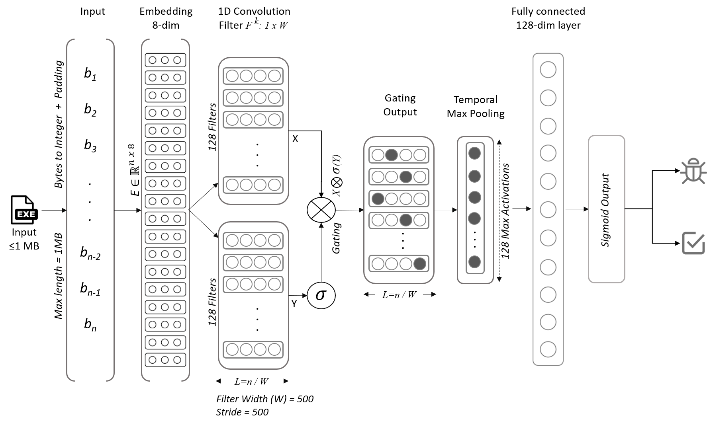

# Two-Tier Malware Detection for Raw Executables

## Brief Overview:

The malware detection framework presented here is an end-to-end, static 
analysis oriented, two-tiered detection technique for Windows portable 
executable (PE) files, aiming to improve malware detection performance by 
locking false positive rate and maximizing true positive rate.

The first tier adopts any existing CNN based malware detection model, 
with the goal of meeting a specified target false positive rate (FPR) 
requirement. Here, we adopt the state-of-the-art model - "Malconv" in the 
first tier. 
While freezing the FPR achieved by first tier, the second tier aims to improve 
the true positive rate (TPR), assisted by some intermediate information 
collected from the training of first tier for effective discerning of PE sections 
that favor TPR improvement. It is achieved through use of a novel mechanism named, 
"Activation Trend Identification (ATI)".

### Implementation Types: 

Currently, there are three types of implementations for the second tier of
 our malware detection framework. Each implementation differs from the other 
 over the kind of data extracted from PE sections and leveraged for 
 the Tier-2 operations. 
They are:
* Top activation blocks - based implementation
* Section-id feed based implementation
* Basic two-tier implementation

For further conceptual details about the above implementations, 
please refer to the draft document.

*__Future Work:__* A fourth type of implementation that combines the 
top activation blocks & the section-id feed implementations, is planned for next 
 phase.

### Malconv Model Architecture:

Malconv is a byte-sequence based CNN model proposed by Raff et al, 
for malware detection. Here, in first tier of our framework, we adopt the [pre-trained version of Malconv model](https://github.com/endgameinc/ember/tree/master/malconv) 
that was made available by Ember team as part of their Ember dataset release. 
The second tier augments the performance of this pre-trained Malconv further.
The incorporated Malconv architecture is illustrated in figure below. The model 
accepts input samples of length upto 1MB.



#### Differences from Ember dataset pre-training: [(Source)](https://github.com/endgameinc/ember/tree/master/malconv#how-does-this-malconv-model-differ-from-that-of-raff-et-al)
* We used a batch_sizes of 64 and 128 based on Compute Canada GPU's available capacities.<br>
Ember pre-training used a batch_size of 100, while the original paper from 
Raff et al used batch_size of 256 samples.

* Ember pre-training reports usage of hyper-parameters such as decay=1e-3, 
while Raff et al reported 
SGD(lr=0.01, momentum=0.9, decay=UNDISCLOSED, nesterov=True ). 
Extensive hyper-parameter tuning is yet to be done for Malconv in our framework. 
Currently, our models use Adam optimizer with learning rate of 0.01

* Raff et al used PE samples of size up to 2MB and Ember pre-training used 
samples of up to 1MB. Here, We also use samples up to 1MB due to GPU memory constraints.


## Dataset Description:

We have gathered an internal dataset called 'DS1' comprised by PE samples 
of maximum size 1MB. It contains a total of 200k samples, with 100k samples 
each for benign and malware (1:1 ratio). The benign samples were collected 
from multiple windows machines and malware samples were obtained from 
VirusTotal. The experimental results presented next, are based on DS1 using a 
(Train:Val):Test split of (80:20):20

*__Note:__*
1. Experiments are not performed over Huawei's small dataset initially provided,
as it contained data only for the 'code' PE section. Our design works with the data of entire PE sample and the different PE sections it has, including 
'code' PE section.

2. We are currently not able to share our DS1 dataset, as it is under Academic license. 
Given a set of raw PE samples, the provided notebook [Data_Preprocessing_and_Partitioning](src/Data_Preprocessing_and_Partitioning.ipynb) 
would help to prepare a dataset befitting our framework.

3. Sample logs for the complete 5-fold cross validation done on DS1 is provided under ```logs```

### Experimental Results over the DS1 dataset:
Cross Validation Type: 5-fold (Target FPR = 0.1%)

|     Implementation Type     | Tier-1<br> Avg. TPR% | Overall<br>Avg. TPR% | TPR<br>Improvement % | Tier-1<br>Avg. FPR% | Overall<br> Avg. FPR% | FPR<br>Difference | Avg. Tier-1<br>Restricted<br>Accuracy | Avg. Overall<br>Restricted<br>Accuracy | Average<br>New TPs | Average<br>New FPs | Average Tier-2<br>Running Time<br> | Average Prediction<br>Time per sample |
|:---------------------------:|:--------------:|:---------------:|:--------------------:|:--------------:|:---------------:|:-----------------:|:--------------------------------:|:---------------------------------:|:------------------:|:------------------:|:-----------------------------------:|:-------------------------------------:|
| Top Activation Blocks based |      90.62     |      93.11      |         2.49         |      0.07      |       0.08      |        0.01       |               0.92               |                0.93               |         260        |          1         |              16 hours             |         90 ms                |
|       Section-Id based      |      90.62     |      93.94      |         3.32         |      0.07      |       0.09      |        0.02       |               0.92               |                0.93               |         288        |          2         |             9 hours            |         75 ms                |
|        Basic two-tier       |      90.62     |      92.91      |         2.29         |      0.07      |       0.12      |        0.05       |               0.91               |                0.89               |         239        |          6         |             23 hours             |         128 ms                 |

On comparing the above results, the top activation & 
section id implementations are able to achieve > 2 to 3% improvement in TPR,
while holding the FPR within target FPR. Both the implementations are better
than the basic two-tier version in providing better performance as well as 
reduced time consumption.
Please note that the experiments were carried out with a target FPR of 0.1% (not 1%). 

The table also provides additional information (scroll right) such as 
the average number of new true positives correctly re-classified by Tier-2 
for the average number of new false positives expended. For example, 
the top activation version is able to re-classify 260 malwares correctly 
for 1 false positive on average. Other information like the average time for completing 
tier-2 training across cross validation and the average prediction time per sample
is also provided - the average prediction time includes data partitioning for test data's B1 set.

Please note that Restricted AUC is calculated for TPR range of 0 to 100 and FPR range of 0 to <Target_FPR value>.
Therefore, it is very sensitive even for a slight FPR increase and poorly sensitive for TPR increase.

### Getting Started:

### Pre-requisites:
1. Raw PE samples are placed in [required directory](#data-organization-and-project-structure).
2. Virtual environment and ipykernel setup as per given [requirements](#environment-details-requirementstxt).
3. 2x additional disk storage space to persist pre-processed data, 
where 'x' is the size of dataset.
4. Supplied PE samples should be parse-able by 'pefile' python library. 
Otherwise, the samples will be filtered out by data pre-processing module.
5. Setup below directory paths in ```settings.py```. 
For help on each item, please check ```python main.py -h``` or ```--help```.

       PROJECT_BASE_PATH
       DATA_SOURCE_PATH
       PKL_SOURCE_PATH
       ALL_FILE
       RAW_SAMPLE_DIRS
       DATASET_BACKUP_FILE

#### Environment Details: [requirements.txt](requirements.txt)
``` python
python==3.6.3
tensorflow-gpu==2.1.0
Keras==2.3.1
pefile==2019.4.18
numba==0.48.0
numpy==1.18.1
nvidia-ml-py3==7.352.0
fasttext==0.9.2
ipykernel==5.3.0
Markdown==3.2
pandas==1.0.3
scikit-learn==0.23.0
seaborn==0.10.1
```

Please refer to the below directory structure that needs to be 
setup for organizing the different forms of data being handled:
* Raw PE samples
* Pickled image representations of PE samples
* Partitions of pickled samples 

#### Data Organization and Project Structure:
```bash
.
├── raw_pe                                  # Place raw pe here
│
├── pickles                                 # Directory created by data pre-processing module
│   ├── t1
│       └── pe_<pickle_index>.pkl
│   └── t2
│       └── pe_<pickle_index>.pkl
│
├── partitions                              # Directory created by partitioning module
│   └── <Dataset_Name>
│       ├── master_partition_tracker.csv
│       ├── p<partition_index>.csv
│       ├── t1_p<partition_index>.pkl
│       └── t2_p<partition_index>.pkl
│
├── Echelon_Block                           # Cloned project directory
│   ├── data                                # Base & Intermediate pickle files
│   ├── log                                 # To store cross validation logs
│   ├── model                               # Trained models are saved here
│   ├── out                                 
│   │   ├── imgs                            # Plots and Charts
│   │   └── result                          # CSV results
│   ├── readme_data
│   └── src
│       ├── analyzers
│       ├── config                          # Settings
│       ├── core                            # Cross validation
│       ├── model_skeleton
│       ├── plots
│       ├── predict
│       ├── train
│       ├── trend                           # Activation Trend Identification code
│       │── utils                           
│       ├── main.py
│       ├── prepare_dataset.py
│       ├── Sample_Run_Block.ipynb
│       ├── Data_Preprocessing_and_Partitioning.ipynb
        └── clean_up.sh
```

### Execution Setup: 

To perform data pre-processing and partitioning, 
please use [Data_Preprocessing_and_Partitioning](src/Data_Preprocessing_and_Partitioning.ipynb)
 notebook.
 
To run experiments, please check below notebooks under respective projects: 
* Top activation blocks based implementation -> Please refer to ```src/Sample_Run_Block.ipynb```
* PE Section-ID based implementation -> Please refer to ```src/Sample_Run_SectionId.ipynb```
* Basic PE Section based implementation -> Please refer to ```src/Sample_Run_Basic.ipynb```

*__Note:__* The sample runs provided in the Jupyter Notebooks above utilized a 
minimal dataset (20% of DS1 data partitions). The data partitions are generated 
through a stratified sampling process using the list of DS1 samples, 
such that each partition contains fairly equal ratio of benign and 
malware.


Along with basic hyper-parameter configuration, there are a plenty of 
two-tier specific options provided that can be configured 
for skipping/resuming parts of the two-tier execution pipeline. For help or to view the list of options, 
please execute the code with the command line switches -h or --help.
```python
python main.py -h
(or)
python main.py --help
```

#### Clean up
Run ```src/clean_up.sh``` to remove all residual files from last run, if needed.

### Acknowledgements
* Raff et al - Malconv Model
* Ember Dataset - Pre-trained Malconv Model

### Future Work:
1. Evaluate performance on 1M dataset.
2. Combining Top activation blocks and Section-id concepts.
3. Merging the code for different tier-2 implementations. 
4. Hyper-parameter tuning in the next phase.
5. Benchmarking on other byte-sequence based CNN models for malware detection.